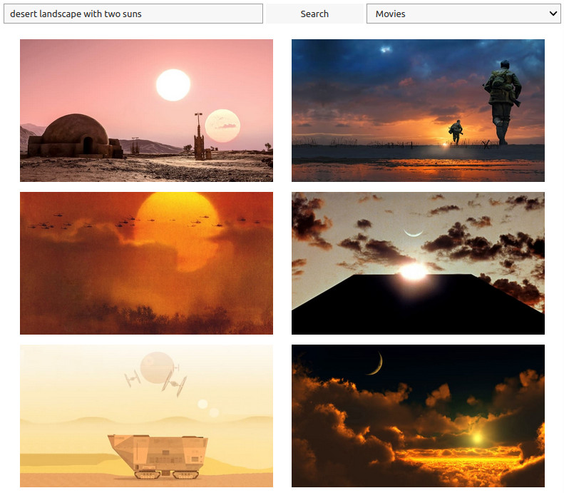

# Minimal user-friendly demo of OpenAI's CLIP

OpenAI's [CLIP](https://openai.com/blog/clip/) is a deep learning model that can estimate the "similarity" of an image and a text. In this way, you can search images matching a natural language query even though your image corpus doesn't include titles, descriptions, keywords...

This repository includes a simple demo built on 25,000 Unsplash images and 7,685 movie images.

## Usage

Click [here](https://colab.research.google.com/github/vivien000/clip-demo/blob/master/clip.ipynb) to try the included notebook in Google Colab. Connect with your Google account and execute the first (and only) code cell.

Alternatively, an equivalent demo can be found as a Hugging Face's [Space](https://huggingface.co/spaces/vivien/clip) (and it works without an account).

## Acknowledgements

Thanks to:
- OpenAI for sharing [CLIP](https://github.com/openai/CLIP)
- Hugging Face for the [transformers](https://huggingface.co/transformers/) library
- [Unsplash](https://unsplash.com/) and [Movie Database (TMDB)](https://www.themoviedb.org/) to allowing hotlinking to their images

I was inspired by [Unsplash Image Search](https://github.com/haltakov/natural-language-image-search) from Vladimir Haltakov and [Alph, The Sacred River](https://github.com/thoppe/alph-the-sacred-river) from Travis Hoppe.
